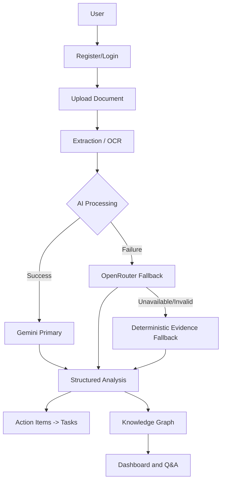
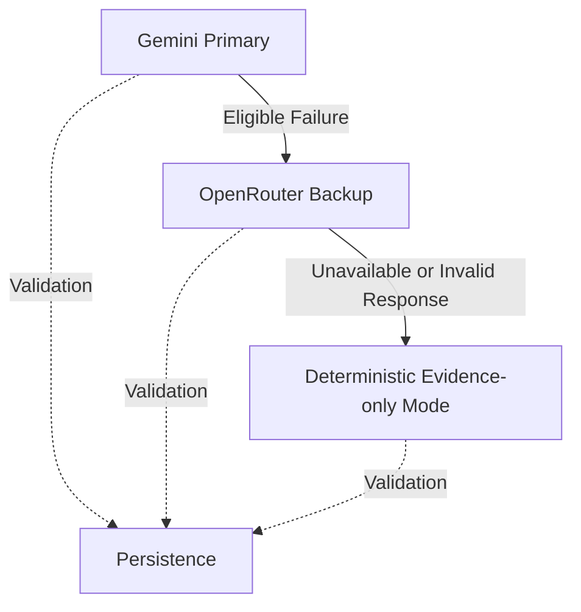
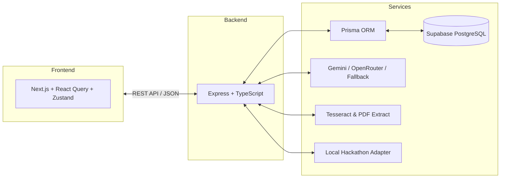

# Intellix AI

“Turn documents into connected knowledge, grounded answers and actionable work.”

Intellix AI is a secure, multi-tenant document intelligence workspace that transforms uploaded files into summaries, tasks, grounded answers and a collaborative multi-document Knowledge Graph.

--------------------------------------------------
## A. PROJECT OVERVIEW
--------------------------------------------------

Teams and organizations often struggle with fragmented information buried across hundreds of disconnected documents. Finding answers, tracking decisions, and understanding who is responsible for what takes significant manual effort. 

Intellix solves this by creating one intelligent workspace. When you upload a document, Intellix doesn't just store it—it reads it, summarizes it, extracts action items and important dates, and automatically connects the insights into a workspace-wide Knowledge Graph. This provides immense value for students, teams, startups, and enterprises by converting passive text into an interactive, interconnected, and actionable network of knowledge.

--------------------------------------------------
## B. CORE FEATURES
--------------------------------------------------

| Feature | Description |
| :--- | :--- |
| **Secure Workspace Authentication** | Multi-tenant isolation with secure JWT-based sessions. |
| **Multi-tenant Supabase Persistence** | Reliable relational data storage using PostgreSQL. |
| **TXT, PDF and Image Uploads** | Supports various file formats for comprehensive knowledge extraction. |
| **Text Extraction and OCR** | Automated text parsing and optical character recognition (OCR) via Tesseract. |
| **Gemini Primary AI** | Fast, high-quality document intelligence via Google Gemini. |
| **OpenRouter Backup Provider** | Automatic fallback ensuring high availability. |
| **Deterministic Evidence-only Fallback** | AI-free source extraction when external providers are unavailable. |
| **Structured Summaries** | Automatic generation of concise document overviews. |
| **Key Points and Keywords** | Highlights essential concepts for quick scanning. |
| **Important Date Extraction** | Identifies critical deadlines and milestones. |
| **Action-item Extraction** | Automatically lists actionable work found in documents. |
| **Confirmed Task Creation** | Convert document action items into trackable workspace tasks. |
| **Grounded Document Q&A** | Ask questions against your documents with source-grounded answers. |
| **Collaborative Knowledge Graph** | Visually explore connections across all documents in a workspace. |
| **Cross-document Entity Search** | Find people, projects, and topics across your entire knowledge base. |
| **Relationship Exploration** | Discover how entities connect (e.g. "Mentions", "Assigned to"). |
| **Source Excerpts and Citations** | Every node and answer is backed by exact document excerpts. |
| **Document Upload History** | Review every document uploaded to the workspace and track its processing timeline. |
| **Dashboard Analytics** | Overview of workspace activity, storage, and entity counts. |
| **Responsive UI** | Seamless experience across mobile and desktop. |
| **Safe Quota & Failure Handling** | System gracefully degrades to Evidence-only mode during API limits. |

**AI Synthesis Mode vs Evidence-only Mode**
Intellix intelligently adapts to provider availability. When AI is available, it provides rich synthesis and summarization. When external APIs fail or hit rate limits, it falls back to **Evidence-only Mode**, extracting raw connections and relationships directly from the text deterministically. The platform remains functional even when external AI providers are unavailable!

--------------------------------------------------
## C. KNOWLEDGE GRAPH FEATURE
--------------------------------------------------

### Collaborative Multi-Document Knowledge Graph

The Knowledge Graph is the heart of Intellix. It connects scattered insights into a unified visual map.
- **Entities**: Discovers people, documents, tasks, dates, technologies, projects, and topics.
- **Relationships**: Automatically infers links such as *Mentions*, *Assigned to*, *Due on*, *Uses*, and *Related to*.
- **Cross-document Connections**: Finds links between entities even if they appear in completely separate documents.
- **Linked Source Evidence**: Every connection retains a link back to the exact chunk and document where it was found.
- **Entity Detail Exploration**: Click any node to instantly view all incoming and outgoing connections.
- **Workspace Graph Rebuild**: Manually trigger graph rebuilds to incorporate newly added documents or tasks.
- **Evidence-grounded Questions**: Ask questions that traverse multiple documents with exact citations.

**Example Insight Flow:**
Abishek → Assigned to → Prepare dashboard
Intellix → Uses → Supabase
Final demo → Due on → Tomorrow

--------------------------------------------------
## D. WORKFLOW DIAGRAM
--------------------------------------------------



--------------------------------------------------
## E. AI PROVIDER ARCHITECTURE
--------------------------------------------------



**Resilience Features:**
- No uncontrolled retries (prevents retry storms).
- Safe error mapping to appropriate internal status codes.
- Strict Zod validation before database persistence.
- Output is always source-grounded (no hallucinated external facts).
- Hidden AI reasoning is never exposed to the user.
- Document evidence and chunks are always preserved regardless of AI status.

--------------------------------------------------
## F. SYSTEM ARCHITECTURE
--------------------------------------------------



--------------------------------------------------
## G. TECHNOLOGY STACK
--------------------------------------------------

| Layer | Technology |
| :--- | :--- |
| **Frontend** | Next.js, React, TypeScript, React Query, Zustand, Vanilla CSS |
| **Backend** | Node.js, Express, TypeScript |
| **Database** | Supabase PostgreSQL |
| **ORM** | Prisma |
| **Authentication** | JWT with HttpOnly cookies, bcrypt |
| **AI Providers** | Google Gemini, OpenRouter |
| **OCR** | Tesseract.js, pdf-parse |
| **Testing** | Vitest, React Testing Library |
| **Styling** | Responsive Vanilla CSS |
| **Deployment Readiness**| Full static/dynamic export capability |

--------------------------------------------------
## H. PROJECT STRUCTURE
--------------------------------------------------

```text
app/          # Next.js frontend routes and pages
components/   # Reusable React UI components
lib/          # Frontend utilities, API clients, store
server/       # Express backend, modular services, API routes
prisma/       # Database schema and migrations
docs/         # Screenshots and project documentation
tests/        # Vitest integration and unit tests
```

- **app/**: The Next.js frontend presentation layer and routing.
- **components/**: Modular UI elements.
- **lib/**: Shared frontend logic and hooks.
- **server/**: The backend API engine processing intelligence.
- **prisma/**: Data structure and migrations.
- **docs/**: Project presentation resources.
- **tests/**: Validates functionality, isolation, and fallback strategies.

--------------------------------------------------
## I. API OVERVIEW
--------------------------------------------------

**Authentication:**
- `POST /api/v1/auth/register`
- `POST /api/v1/auth/login`
- `POST /api/v1/auth/refresh`
- `POST /api/v1/auth/logout`
- `GET /api/v1/auth/me`

**Documents:**
- `POST /api/v1/documents`
- `GET /api/v1/documents`
- `GET /api/v1/documents/:id`
- `POST /api/v1/documents/:id/retry`
- `DELETE /api/v1/documents/:id`

**Tasks:**
- `POST /api/v1/tasks`
- `GET /api/v1/tasks`
- `PATCH /api/v1/tasks/:id`
- `DELETE /api/v1/tasks/:id`

**Dashboard:**
- `GET /api/v1/dashboard/summary`

**Knowledge Graph:**
- `GET /api/v1/knowledge-graph`
- `GET /api/v1/knowledge-graph/search`
- `GET /api/v1/knowledge-graph/entities/:entityId`
- `POST /api/v1/knowledge-graph/questions`
- `POST /api/v1/knowledge-graph/rebuild`
- `POST /api/v1/documents/:documentId/knowledge-graph/rebuild`

--------------------------------------------------
## J. LOCAL SETUP
--------------------------------------------------

**Requirements:**
- Node.js
- pnpm
- PostgreSQL / Supabase project

**Commands:**
```bash
pnpm install
pnpm prisma:generate
pnpm prisma:migrate:deploy
pnpm dev:api
pnpm exec next dev --port 3003
```

**Local URLs:**
- Frontend: `http://localhost:3003`
- Backend: `http://localhost:4000`
- Health: `http://localhost:4000/api/v1/health`

**Environment Configuration (`.env`):**
Create a `.env` file at the root. Use placeholders for sensitive keys:
```env
DATABASE_URL=""
DIRECT_URL=""
JWT_ACCESS_SECRET=""
JWT_REFRESH_SECRET=""
GEMINI_API_KEY=""
GEMINI_MODEL="gemini-2.0-flash"
OPENROUTER_API_KEY=""
OPENROUTER_MODEL="openrouter/free"
FRONTEND_URL="http://localhost:3003"
NEXT_PUBLIC_API_URL="http://localhost:4000/api/v1"
```

--------------------------------------------------
## K. DEMO FLOW
--------------------------------------------------

1. **Register workspace**: Create a secure tenant workspace.
2. **Upload document**: Upload text, PDF, or images.
3. **Show summary, keywords, dates and action items**: Review auto-generated intelligence.
4. **Convert an action item to a task**: Click to turn an extracted action item into a tracked task.
5. **Open dashboard**: View updated workspace metrics and total processed documents.
6. **Build Knowledge Graph**: Manually rebuild the workspace graph from new insights.
7. **Select an entity**: Search or click a node in the graph to open detail view.
8. **Show linked documents and evidence**: View connected tasks, dates, and raw text evidence.
9. **Ask a cross-document question**: Ask a grounded question and get a cited answer.
10. **Explain Evidence-only resilience**: Demonstrate how the graph and answers continue to work natively even if APIs are restricted.

--------------------------------------------------
## L. SECURITY
--------------------------------------------------

- **Passwords**: Securely hashed with bcrypt.
- **Sessions**: Short-lived JWT access tokens with rotating refresh tokens (HttpOnly cookies).
- **Isolation**: Workspace isolation enforced at the API layer.
- **Uploads**: Strict filename sanitization and MIME-type validation.
- **Rate Limiting**: Protects against abuse and uncontrolled API consumption.
- **Secret Isolation**: Provider keys are handled purely backend-side; no provider keys sent to the frontend.
- **Validation**: End-to-end Zod validation blocks invalid payloads and no raw AI errors exposed.

--------------------------------------------------
## M. TESTING AND QUALITY
--------------------------------------------------

- **Total tests passed**: 108 passed
- **Typecheck**: Success (0 errors)
- **Lint**: Success (0 errors)
- **API Build**: Success
- **Frontend Build**: Success (Optimized production build generated)
- **Coverage**: Comprehensive tests covering knowledge UI, auth, provider fallback, and tenant-isolation.

--------------------------------------------------
## N. HACKATHON INNOVATION
--------------------------------------------------

What makes Intellix unique:
- **AI is not a single point of failure**: The system runs gracefully when APIs fail.
- **Evidence survives provider outages**: Deterministic fallback prevents catastrophic data loss.
- **Grounded context**: Tasks, dates, and documents become graph connections.
- **Multi-document discovery**: Navigate insights far beyond standard keyword searches.
- **Reduced Hallucinations**: Grounded citations map every AI claim to a real document excerpt.
- **Workspace-level reasoning**: Understand complex questions across multiple silos.
- **Safe deterministic fallback**: Evidence extraction guarantees continuous document operation.

--------------------------------------------------
## O. LIMITATIONS AND FUTURE SCOPE
--------------------------------------------------

**Current Limitations:**
- Local file storage is used.
- In-process jobs (blocking execution on large files).
- Deterministic mode is extractive, not generative.
- Free-provider availability may change.
- Scanned PDF limits based on OCR capacity.
- Local development CORS configuration constraints.

**Future Scope:**
- Object storage integration.
- BullMQ / background workers for async processing.
- Vector retrieval for high-scale RAG.
- Interactive Graph Visualization Canvas.
- Collaboration and sharing features.
- Analytics history.
- Deployment and hosting.
- Push notifications.
- Role-based permissions.

--------------------------------------------------
## P. TEAM CONTRIBUTIONS
--------------------------------------------------

- **Abishek**: Frontend and responsive UI, Dashboard, Authentication screens, Knowledge Graph explorer.
- **Ajaykumar**: Supabase and Prisma, Authentication backend, Runtime configuration and API stability.
- **Aakash**: Gemini/OpenRouter integration, OCR and document processing, Deterministic fallback, Knowledge Graph backend and testing.

--------------------------------------------------
## Q. SCREENSHOTS
--------------------------------------------------


--------------------------------------------------
## R. STATUS
--------------------------------------------------

- **Authentication**: Working
- **Database**: Working
- **Document upload**: Working
- **Evidence-only fallback**: Working
- **Tasks**: Working
- **Knowledge Graph**: Working
- **Responsive UI**: Working
- **Automated tests**: Passing
- **External Gemini/OpenRouter availability**: Environment dependent
